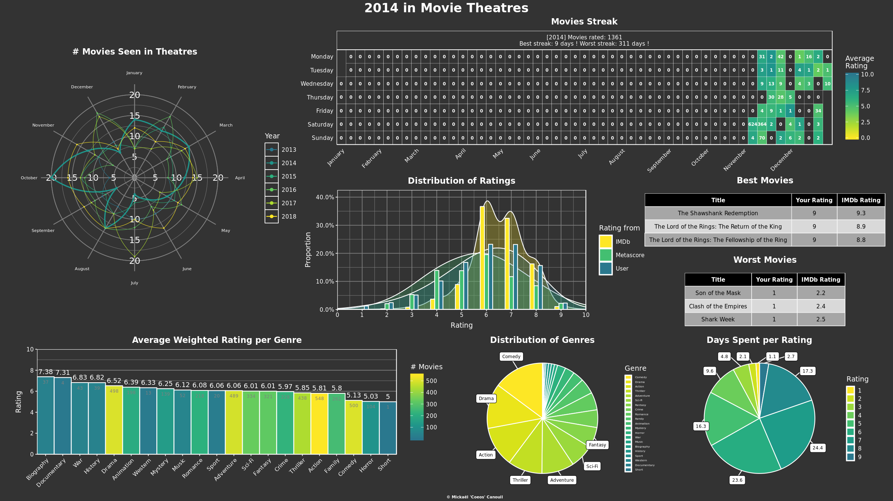
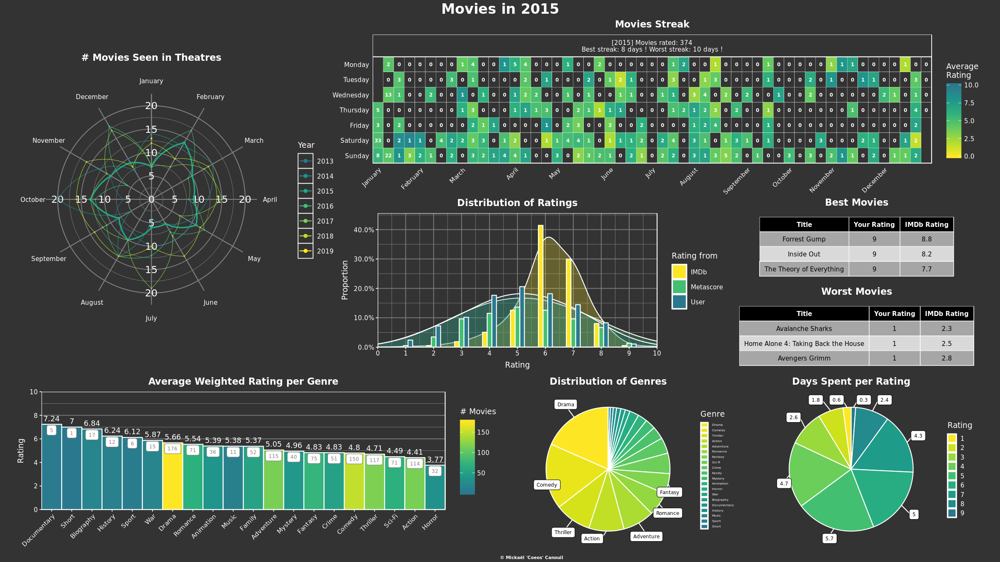
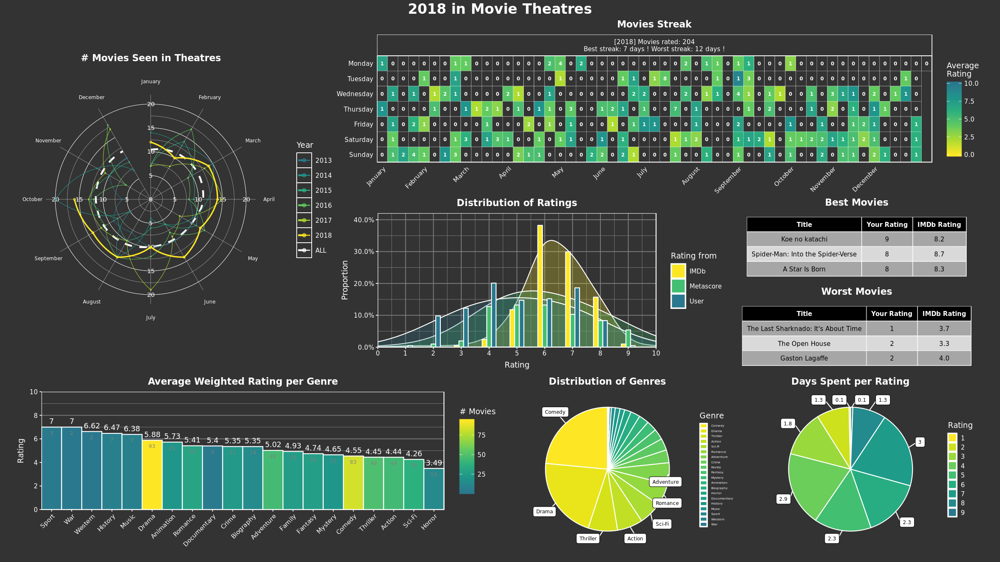
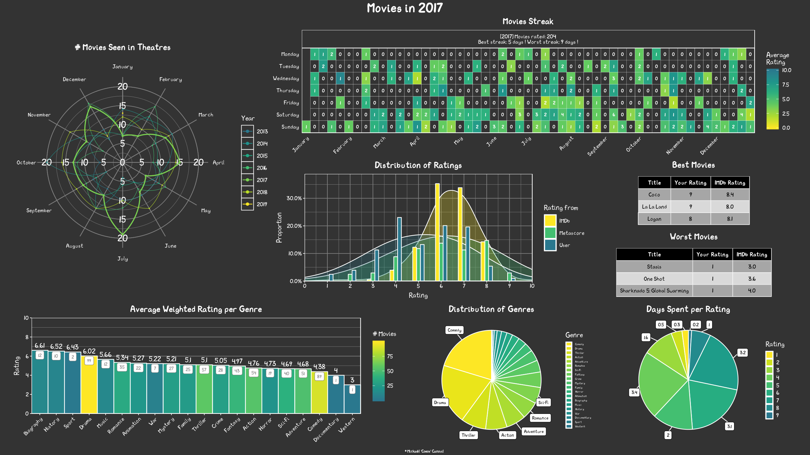
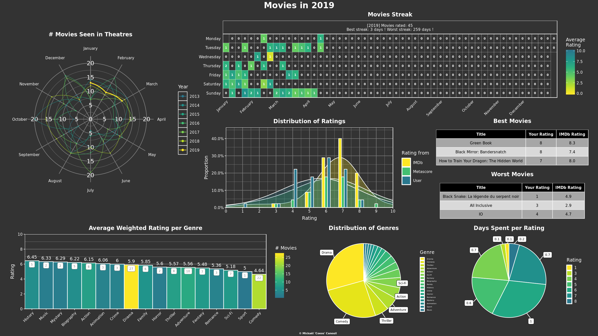
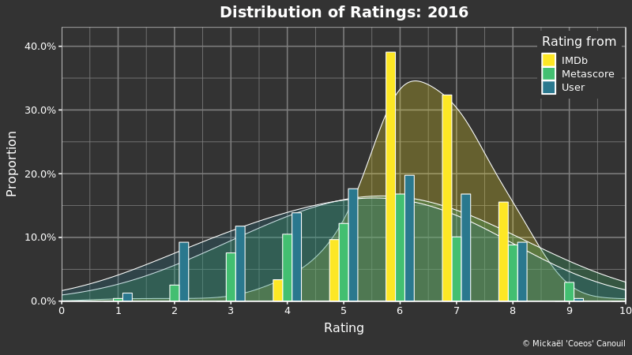
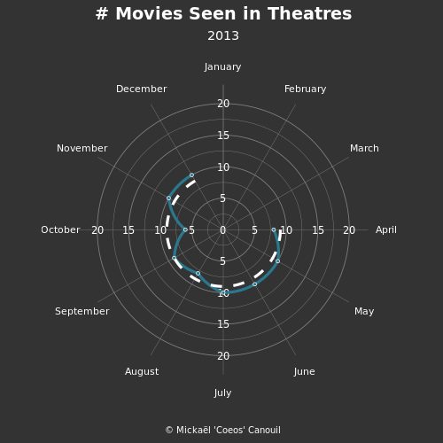
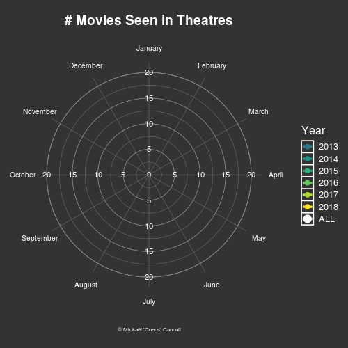

# Infography {.tabset}

## 2014   

## 2015   

## 2016   

## 2017   

## 2018   

## 2019   

# GIF

## Ratings distribution

## Movies at theatre {.tabset}

### Circular-smooth

### Radar-radius

### Radar-waves-point

### Radar-waves-path

